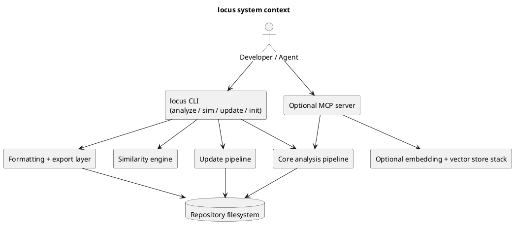
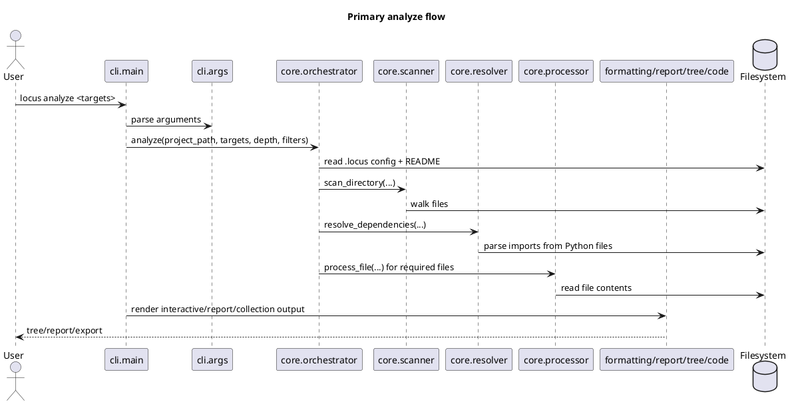

# System Design — locus

## Generation Metadata
- Date: `2026-03-14`
- Commit: `fab3afa`
- Repo: `locus`
- Author/Agent: `system-design-document (driven by miloc-docmap)`
- Source template: `~/.miloc/templates/system-design-document/.miloc/.template/docs/SYSTEM_DESIGN.md`

## Purpose and Scope
- System purpose: Help users extract high-signal code context from a repository, format it for LLM workflows, and optionally apply structured Markdown edits back to files.
- Primary users / operators: developers, maintainers, and agents working locally against a source tree.
- In scope: CLI command parsing, repository scanning, dependency resolution, annotation extraction, report/export formatting, update application, similarity detection, and optional MCP indexing/search support.
- Out of scope: hosted services, IDE replacement, and mandatory installation of heavy MCP dependencies.

## Read This With
1. `.miloc/docs/ASSEMBLY.md`
2. `README.md`
3. `.miloc/docs/CONTRIBUTING.md`
4. `.miloc/docs/ARCHITECTURE.md`
5. `.miloc/docs/TESTS.md`
6. `src/locus/similarity/README.md`

## System Context
`locus` is a local-first Python package with one primary operating surface: the CLI. Users call `analyze` to inspect a repo, `sim` to detect duplicate code, `update` to materialize Markdown-provided file changes, and `init` to scaffold agent-oriented project docs. The base install stays lightweight; the optional MCP mode layers embeddings, indexing, and server tools on top of the same repository-analysis primitives.

## Component Model
| Component | Responsibility | Inputs / Outputs | Notes |
|---|---|---|---|
| `src/locus/cli/` | Parse commands and dispatch user workflows | CLI args / stdout, stderr, files | Boundary layer; chooses which pipeline to run |
| `src/locus/core/` | Scan repo, build file tree, resolve imports, orchestrate analysis | Paths, include/exclude patterns -> `AnalysisResult` | Main analysis engine; intended to stay reusable |
| `src/locus/formatting/` | Render tree/report/code output and console UX | `AnalysisResult` -> terminal or Markdown output | Presentation-only layer |
| `src/locus/updater/` | Parse Markdown file blocks and apply writes/backups | stdin Markdown -> file updates | Safety boundary for file writes |
| `src/locus/init/` | Create project template docs and configs | target dir + flags -> created files | Handles conflict prompts and template loading |
| `src/locus/similarity/` | Detect duplicate or near-duplicate Python functions | `AnalysisResult` -> similarity clusters/JSON | Current MVP supports exact and AST-oriented strategies |
| `src/locus/mcp/` | Serve/search indexed codebases with optional heavy deps | indexed repo + MCP requests -> search/context responses | Explicitly optional; guarded by dependency checks |
| `src/locus/search/` | Protocols and engine for hybrid code search | embedder/store abstractions -> normalized hits | Separates search interfaces from concrete MCP implementation |

## Entrypoints
- CLI / commands:
  - `python3 -m locus analyze ...`
  - `python3 -m locus sim ...`
  - `python3 -m locus update < changes.md`
  - `python3 -m locus init --config`
- Services / jobs:
  - Optional MCP launcher: `python3 -m locus.cli.mcp_cmd` or installed `locus mcp ...`
  - MCP subcommands in `src/locus/mcp/launcher.py`: `serve`, `index`
- Scheduled tasks:
  - None in-repo; automation is GitHub-side review/comment workflows only
- Human-operated workflows:
  - Prepare repo context for an LLM
  - Compare duplicate code clusters
  - Apply Markdown-generated patch blocks to the working tree
  - Scaffold project docs/config via `init`

## Module and Repo Layout
| Path | Responsibility | Ownership / notes |
|---|---|---|
| `pyproject.toml` | Package metadata and dependency extras | Base deps stay light; `[mcp]` and `[dev]` are additive |
| `Makefile` | Common install/test/lint/format shortcuts | Uses `python`; some environments may require `python3` directly |
| `.locus/allow`, `.locus/ignore` | Repo-wide default analysis filters | Part of the analysis contract |
| `src/locus/__main__.py` | `python -m locus` entry | Thin shim into CLI main |
| `src/locus/cli/args.py` | Argument schema and help surfaces | Defines `analyze`, `sim`, `update`, `init` |
| `src/locus/cli/main.py` | Command handlers and orchestration | Boundary between CLI and internal modules |
| `src/locus/core/` | Analysis, scanning, dependency resolution, config, modular export | Core logic and orchestration |
| `src/locus/formatting/` | Markdown/tree/code/console rendering | Presentation concerns only |
| `src/locus/init/` | Template lookup and file creation | Initializes agent-facing repo docs/config |
| `src/locus/updater/` | Markdown parsing and filesystem application | Only write path in the base CLI |
| `src/locus/similarity/` | Duplicate detection implementation and docs | Self-contained feature area |
| `src/locus/mcp/` | Optional indexing, DI, server tools, settings | Requires extra dependencies |
| `src/locus/search/` | Search contracts and engine | Shared abstractions for MCP/code search |
| `tests/` | Fast test suite for core package | `tests/mcp/` covers the optional MCP path |
| `.github/workflows/` | Claude-driven issue/review automation | No build/release pipeline defined here |

## Primary Flows
### 1. Analyze flow
The `analyze` command parses target specifiers, determines the repo/config root, loads `.locus` allow/ignore rules, scans the filesystem, resolves imports for Python files when depth is enabled, processes files into `AnalysisResult`, and renders either interactive output, a single Markdown report, or a modular export directory.

### 2. Update flow
The `update` command reads Markdown from stdin, extracts fenced code blocks whose first line declares `# source: <path>`, normalizes edge cases around backticks, previews or applies file writes, and can create `.bak` backups before overwriting existing files.

### 3. Optional MCP flow
The MCP launcher first checks for heavyweight dependencies, builds a DI container, then either serves MCP tools or indexes codebase paths into the vector store. Search abstractions are isolated in `src/locus/search/` so the CLI core does not depend on MCP runtime packages.

## Interfaces and Contracts
- External APIs / services:
  - Local CLI contract defined in `src/locus/cli/args.py`
  - Optional MCP server contract implemented under `src/locus/mcp/server/tools/`
- File formats / storage contracts:
  - `.locus/allow` and `.locus/ignore` define repo-level scanning policy
  - `.locus/settings.json` is the modular export config surface created by `init --config`
  - Markdown update blocks must begin with `# source:` or `source:` on the first line inside the code fence
  - Similarity JSON output is an explicit serialized payload written on demand
- Config and env vars:
  - Package metadata and extras live in `pyproject.toml`
  - Optional NO_COLOR behavior is honored by the CLI
  - MCP settings live under `src/locus/mcp/settings/`
- Auth / secret boundaries:
  - Base CLI has no secret handling surface
  - GitHub Actions rely on `CLAUDE_CODE_OAUTH_TOKEN` in workflow configuration
  - MCP-related docs should describe locations/settings, not credentials

## Invariants and Constraints
- The base package must remain usable without installing MCP extras.
- CLI handlers own I/O and user interaction; formatting modules should stay presentation-focused; reusable analysis/search logic stays outside the CLI boundary.
- `core.orchestrator.analyze()` is the central contract for repo scanning and analysis result assembly.
- Dependency resolution only follows Python imports when depth is enabled.
- Update operations are explicit and reviewable; the updater never infers target paths without a `source:` line.
- `.locus` config is discovered from the repository root, not only the immediate working directory.

## Failure Modes and Operational Notes
- Known hot paths / bottlenecks:
  - Large repo scans and full-depth dependency walks can be expensive.
  - MCP indexing/search depends on heavyweight libraries and vector-store performance.
- Logging / observability:
  - CLI and MCP launcher use rich logging/console helpers.
  - Many failure paths are surfaced as explicit log messages rather than silent fallbacks.
- Deployment / release shape:
  - Python package built with setuptools and installed locally in editable or regular mode.
  - GitHub workflows present here are for Claude automation, not artifact publishing.
- Recovery / rollback notes:
  - Use `locus update --dry-run` before writing files.
  - Use `locus update --backup` or Git to recover from unwanted file updates.
  - If local commands fail because the package is not installed, retry with `PYTHONPATH=src python3 -m locus ...`.

## Open Questions
- Should the repo standardize on `python3` in `Makefile` and docs to reduce alias-related failures?
- If MCP functionality expands, does it need its own deeper operational runbook under `.miloc/docs/`?

## Reference Pages / Existing Docs
- `README.md` — product overview and common CLI usage
- `.miloc/docs/CONTRIBUTING.md` — setup, quality, and workflow commands
- `.miloc/docs/ARCHITECTURE.md` — repo-level design guidelines
- `.miloc/docs/TESTS.md` — testing philosophy and patterns
- `src/locus/similarity/README.md` — detailed similarity feature notes and benchmark guidance

## How to Extend / Where to Add Features
- Add new CLI flags or subcommands in `src/locus/cli/args.py` and wire handlers in `src/locus/cli/main.py`.
- Add new analysis behavior in `src/locus/core/`; keep rendering changes in `src/locus/formatting/`.
- Extend safe project bootstrap behavior in `src/locus/init/`.
- Extend Markdown patch parsing or application behavior in `src/locus/updater/`.
- Extend duplicate detection strategies inside `src/locus/similarity/` and update its README/tests together.
- Keep optional MCP changes isolated to `src/locus/mcp/` and `src/locus/search/` so the base install does not regress.

## Change Log
> If this is the first version, write `initial`.

- initial

## Build & Verify
- Setup:
  - `make install-dev`
  - Fallback when using the raw source tree: `PYTHONPATH=src python3 -m pip install -e .[dev]`
- Run:
  - `PYTHONPATH=src python3 -m locus analyze -p`
  - `PYTHONPATH=src python3 -m locus sim src -s ast`
- Test:
  - `PYTHONPATH=src python3 -m pytest tests/ --ignore=tests/mcp -q`
- Lint / format:
  - `python3 -m ruff check src/ tests/`
  - `python3 -m ruff format --check src/ tests/`
